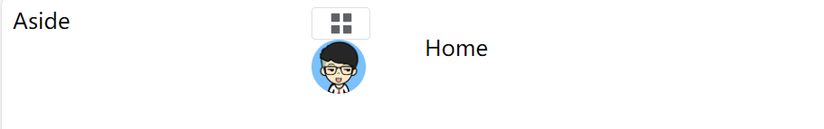

# vue_project2记录

## vite创建项目

创建项目：

```
yarn create vite vue_project2 --template vue
```

安装依赖：

```
cd vue_project2
yarn install
```

启动：

```
yarn dev
```


## 引入ElementPlus

+ 先安装：

```
yarn add element-plus
```

+ 然后引入：

完整引入：会导致打包后的文件偏大

```javascript
//main.js
import { createApp } from 'vue'
import './style.css'
import App from './App.vue'

import ElementPlus from 'element-plus'
import 'element-plus/dist/index.css'

const app=createApp(App);
app.use(ElementPlus)
app.mount('#app')
```

自动引入：推荐

先安装：

```javascript
npm install -D unplugin-vue-components unplugin-auto-import
```

再引入：

```javascript
// vite.config.ts
import { defineConfig } from 'vite'
import AutoImport from 'unplugin-auto-import/vite'
import Components from 'unplugin-vue-components/vite'
import { ElementPlusResolver } from 'unplugin-vue-components/resolvers'

export default defineConfig({
  // ...
  plugins: [
    // ...
    AutoImport({
      resolvers: [ElementPlusResolver()],
    }),
    Components({
      resolvers: [ElementPlusResolver()],
    }),
  ],
})
```

## 引入vue-router

在src文件夹下新建views文件夹（用于存放组件）和router文件夹（用于放路由设置）

+ 复习一下router下index.js的配置：

首先引入createRouter和createWebHashHistory的API:

```javascript
import { createRouter,createWebHashHistory } from "vue-router"
```

路由数组解构：

```javascript
const routes=[
    {
        path:'/',
        component:()=>import('../views/Main.vue'),
        children:[
            {
                path:'/',
                name:'home',
                component:()=>import('../views/home/Home.vue')
            }
        ]
    }
]
```

创建`router`对象并导出：

```javascript
const router=createRouter({
    history:createWebHashHistory(),
    routes
})

export default router
```

按层次在`App.vue`和`Main.vue`中放入\<router-view>

注意这里分两层，一层是根，根下面的children数组是第二层

## 整体布局实现

在ElementUI官网上找到相应布局即可

（下面示例同时展示了\<router-view>位置和布局）

```vue
<!--Main.vue-->
<template>
  <div class="common-layout">
    <el-container>
      <el-aside width="200px">Aside</el-aside>
      <el-container>
        <el-header>Header</el-header>
        <el-main>
            <router-view/>
        </el-main>
      </el-container>
    </el-container>
  </div>
</template>
```

```vue
<!--App.vue-->
<template>
  <router-view/>
</template>
```

## Header顶栏实现

### Header1-图标引入

找到`Main.vue`中\<el-header>的位置，放上从`CommonHeader.vue`引入的组件，注意\<el-header>标签放在组件里而非原位置

引入图标，在ElementUI官网上找即可

```vue
<!--Commonheader.vue-->
<template>
  <el-header>
    <div class="l-content">
        <el-button size="small">
            <el-icon :size="20"><Menu/></el-icon>
        </el-button>
      
    </div>
    <div class="r-content"></div>
  </el-header>
</template>
```

```vue
<!--Main.vue-->
<template>
  <div class="common-layout">
    <el-container>
      <el-aside>
      </el-aside>
      <el-container>
        <CommonHeader/>
        <el-main>
            <router-view/>
        </el-main>
      </el-container>
    </el-container>
  </div>
</template>
```

### Header2-右侧下拉菜单的实现

从ElementPlus官网找到dropdown，按照语法规则引入即可

```html
<div class="r-content">
      <el-dropdown>
        <span class="el-dropdown-link">
          
        </span>
        <template #dropdown>
          <el-dropdown-menu>
            <el-dropdown-item>个人中心</el-dropdown-item>
            <el-dropdown-item>退出</el-dropdown-item>
          </el-dropdown-menu>
        </template>
      </el-dropdown>
</div>
```

### 调整Header处布局

此时.el-header的盒子布局相当的乱（里面有一个.l-container和一个.r-container，div默认换行，且大小未设置，呈如下状）



对.el-header进行盒子布局，让.l-container靠左，r-container靠右并在同一行：

```css
.el-header {
  display: flex;
  justify-content: space-between;
  align-items: center;
  width:100%;
}
```

这时下方出现了滑动栏，查询页面元素后发现是Home.vue组件到.el-header后面去了，说明它们的父组件是没换行的flex盒子

对其进行如下改动：

```css
.el-container{
  flex-wrap: wrap;
}
```

## 动态引入资源

从vite官网上找到：

`new URL()`方法：第一个参数为相对路径，第二个参数为当前路径

```javascript
function getImageUrl(name) {
  return new URL(`./dir/${name}.png`, import.meta.url).href
}
```

然后在HTML中引入即可：

```HTML

```

## 左侧菜单实现

### 引入el-menu

```html
<el-menu
    default-active="2"
    class="el-menu-vertical-demo"
    @open="handleOpen"
    @close="handleClose"
>
    <el-menu-item index="2">
    <el-icon><icon-menu /></el-icon>
    <span>Navigator Two</span>
    </el-menu-item>
    <el-sub-menu index="1">
      <template #title>
        <el-icon><location /></el-icon>
        <span>Navigator One</span>
      </template>
     <el-menu-item-group title="Group One">
        <el-menu-item index="1-1">item one</el-menu-item>
        <el-menu-item index="1-2">item two</el-menu-item>
     </el-menu-item-group>
     <el-menu-item-group title="Group Two">
        <el-menu-item index="1-3">item three</el-menu-item>
     </el-menu-item-group>
     <el-sub-menu index="1-4">
        <template #title>item four</template>
        <el-menu-item index="1-4-1">item one</el-menu-item>
      </el-sub-menu>
    </el-sub-menu>

</el-menu>
```

### 用for循环将el-menu重构

首先写两个方法帮助确定应该写在el-menu-item里还是el-sub-item中：

```javascript
const noChildren = () => {
  return list.filter((item) => !item.children);
};
const hasChildren = () => {
  return list.filter((item) => item.children);
};
```

引入html中：

```html
<el-menu
  class="el-menu-vertical-demo"
  background-color="#545c64"
  text-color="#fff"
  :collapse="false"
>
  <el-menu-item
    :index="item.path"
    v-for="item in noChildren()"
    :key="item.path"
  >
    <component :is="item.icon" class="icons"></component>
    <span>{{ item.label }}</span>
  </el-menu-item>
  <el-sub-menu
    :index="item.path"
    v-for="item in hasChildren()"
    :key="item.path"
  >
    <template #title>
      <component :is="item.icon" class="icons"></component>
      <span>{{ item.label }}</span>
    </template>
    <el-menu-item-group>
      <el-menu-item
        :index="1 - 1"
        v-for="(subItem, subIndex) in item.children"
        :key="subIndex"
      >
        <component :is="subItem.icon" class="icons"></component>
        <span>{{ subItem.label }}</span>
      </el-menu-item>
    </el-menu-item-group>
  </el-sub-menu>
</el-menu>
```

### icon的动态引入

```html
<component :is="item.icon" class="icons"></component>
```

\<component>标签的is属性可以用来引入外部组件

## 基础样式整理实现

### 引入`reset.less`

在assets下开less文件夹，放入index.less和reset.less

index.less是所有less文件的汇总，便于管理，如下引入reset.less：

```less
@import "./reset.less";
```

再在main.js中引入：

```javascript
import './assets/less/index.less'
```

这时出现了报错：

```
[vite] Internal server error: Preprocessor dependency "less" not found. Did you install it? Try `yarn add -D less`.
```

安装less依赖后成功解决

**成功引入reset.less后，浏览器与组件之间的缝隙没有了**

### 调整几个大盒子的高度

首先是最外层的#app：

```css
/*App.vue*/
#app{
  height:100%;
}
```

其次是.common-layout和它的孩子.el-container：

```css
/*Main.vue*/
.common-layout {
  height: 100%;
  & > .el-container {
    height: 100%;
  }
}
```

最后是el-aside，它还需要背景色和menu一致：

```css
/*CommonAside.vue*/
.el-aside{
  height: 100%;
  background-color: #545c64;
}
```

### 一些细节的调整

+ 首先发现home组件跑到header右边了，（原因是右侧的.el-container盒子模型不换行，改成`flex-wrap:wrap`）

+ .el-menu有右边距，去掉：

```css
.el-menu{
  border-right:none;
}
```

+ home和.el-header之间有一块空白：这是由于它们的父元素.el-container是flex盒子，默认align-items为stretch导致。将align-items换成flex-start即可靠交叉轴起始位置对齐

```css
.el-container {
  flex-wrap: wrap;
  align-items: flex-start;
}
```

## vuex实现左侧菜单伸缩

需求：通过Menu按钮实现控制菜单的展开和收缩。当菜单展开时，宽度180px；收缩时，宽度64px

实现：el-menu默认有collapse的值实现伸缩。用vuex控制这个值的变化，同时在width处设置逻辑

+ 配置vuex：

```javascript
//store/index.js
import { createStore } from "vuex";
const store=createStore({
    state:{
        isCollapse:false,
    },
    mutations:{
        updateIsCollapse(state, payload){
            state.isCollapse=!state.isCollapse;
        }
    }
});
export default store
```

+ 在main.js中使用：

```javascript
import { createApp } from 'vue'
import './style.css'
import App from './App.vue'
import router from './router/index.js'
import store from './store/index.js'

import './assets/less/index.less'
import * as ElementPlusIconsVue from '@element-plus/icons-vue'


const app=createApp(App);
for (const [key, component] of Object.entries(ElementPlusIconsVue)) {
    app.component(key, component)
}
app.use(router).use(store)
app.mount('#app')
```

+ 在el-menu处用store.state控制值：

```html
<el-aside :width="$store.state.isCollapse ? '64px' : '180px'">
    <el-menu
      class="el-menu-vertical-demo"
      background-color="#545c64"
      text-color="#fff"
      :collapse="$store.state.isCollapse"
      :collapse-transition="false"
    >
```

+ 在button处声明新函数，同时获取store对象，调用相关方法

```javascript
import { useStore } from "vuex";
const store = useStore();
const handleCollapse = () => {
  store.commit("updateIsCollapse");
};
```

```html
<el-button size="small" @click="handleCollapse">
    <el-icon :size="20"><Menu /></el-icon>
</el-button>
```

## 用router实现左侧菜单路由跳转

用useRouter()获取router对象，router.push()可以跳转路由，和\<router-link to="">是一样的，这里由于标签已经设计好，不用\<router-link>

注意这里跳转的路由必须在createRouter中声明过，故createRouter()的参数routes数组应该改为如下：

```javascript
const routes=[
    {
        path:'/',
        component:()=>import('../views/Main.vue'),
        redirect:'/home',
        children:[
            {
                path:'/home',
                name:'home',
                component:()=>import('../views/home/Home.vue')
            },
            {
                path:'/user',
                name:'user',
                component:()=>import("../views/user/User.vue")
            },
            {
                path:'/page1',
                name:'page1',
                component:()=>import("../views/Page1.vue")
            },
            {
                path:'/page2',
                name:'page2',
                component:()=>import("../views/Page2.vue")
            }
        ]
    }
]
```

将相关函数放入html中：

```vue
<template>
  <el-menu-item
    :index="item.path"
    v-for="item in noChildren()"
    :key="item.path"
    @click="onClickMenu(item)"
  >
  <el-menu-item
      :index="1 - 1"
      v-for="(subItem, subIndex) in item.children"
      :key="subIndex"
      @click="onClickMenu(subItem)"
  >
</template>
<script setup>
const router=useRouter();
const onClickMenu=(item)=>{
  router.push(item);
}
</script>
```

## home内容实现

### 栅格布局

